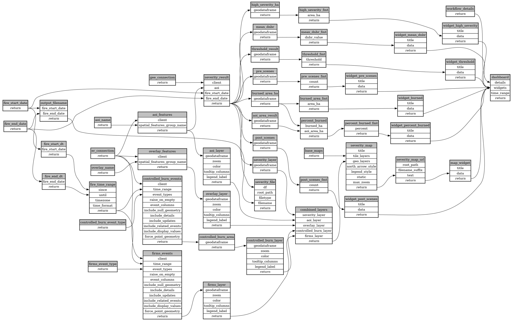

```
# AUTOGENERATED BY ECOSCOPE-WORKFLOWS; see fingerprint in README.md for details

```

```yaml
# fingerprint:
artifacts_sha256_basic: be89f5366f9bca452c4cdb0b9e0bc38676788347fafe8b143cc320652f296d09
artifacts_sha256_strict: adfa6a2274c07b6bee33d5936b85fecb1899110ae5eac2435c9d5ccf410a2d40
installed_requirements:
- channel: https://repo.prefix.dev/ecoscope-workflows/
  name: ecoscope-platform
  version: {version: ==2.15.1}
- channel: conda-forge
  name: pydeck
  version: {version: ==0.9.2}
params_sha256: 7e8c0c92aa85c85c537b8b8ecf008a17394942508430aa937b691ace530d0ac4
spec_sha256: 2cb50cb16339de3ae7e1d06404a093556c619301ed8882092901abe273722205

```

# ecoscope-workflows-dnbr-burn-severity-workflow


